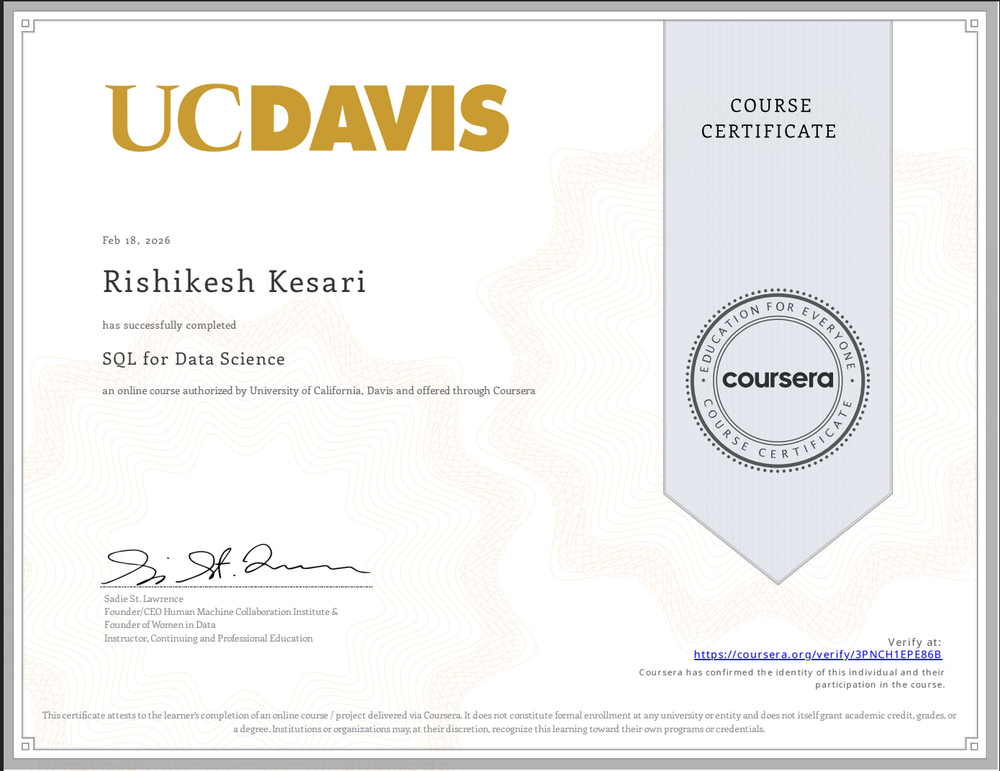

# SQL for Data Science – USDA Production Analysis

    

## Overview

This repository documents my completion of the **SQL for Data Science (UC Davis, Coursera)** course, with a primary focus on a comprehensive final project built using USDA agricultural production datasets.

The project simulates a real-world scenario in which I worked as a Data Scientist at the United States Department of Agriculture, responding to structured business questions using SQL.

While the course provided foundational SQL knowledge, this repository emphasizes the applied final project, which demonstrates database design, data cleaning, complex querying, and analytical reasoning.

---

# Course Summary (25%)

The SQL for Data Science course covered:

- SELECT statements and filtering  
- WHERE conditions and logical operators  
- GROUP BY and HAVING  
- Aggregation functions (`SUM`, `AVG`, `COUNT`, `MAX`)  
- JOIN operations (INNER, LEFT)  
- Subqueries  
- UNION operations  
- Sorting and NULL handling  

The course focused on building structured thinking in querying relational databases.

---

# Final Project – USDA Production Data Analysis (75%)
Purpose driven project!
- Checkout the SQL project hands-on implementation on python [here](https://github.com/rishi-analytics/sql-for-data-science-usda-production-analysis/blob/main/notebook/README.md#project-summary)
## Scenario

As a Data Scientist at the USDA, I analyzed multi-year agricultural production datasets across U.S. states, including:

- Milk Production  
- Cheese Production  
- Coffee Production  
- Honey Production  
- Yogurt Production  
- State Lookup (ANSI codes)

The objective was to answer structured business questions raised during strategic discussions and reporting meetings.

---

# Database Implementation

The project was implemented using:

- SQLite (database engine)
- Python (`sqlite3`)
- Google Colab

### Workflow

1. Mounted Google Drive
2. Created SQLite database
3. Built tables using provided SQL schema
4. Imported seven CSV datasets
5. Cleaned numeric fields (removed comma formatting)
6. Executed analytical SQL queries to answer graded assignment questions
7. Structured all work in a reproducible notebook

---

# Graded Assignment – Business Questions Solved Using SQL

Below are representative examples of business-driven SQL questions addressed in the final project:

### 1. Total Milk Production (2023)
- Computed total production using `SUM()` with proper type casting.
- Delivered production value for executive reporting.

### 2. High Cheese Production States (April 2023)
- Identified states with production greater than 100 million.
- Used filtering and JOIN with state_lookup.
- Provided count of qualifying states for targeted marketing focus.

### 3. Coffee Production Trend Analysis
- Retrieved total production for 2011.
- Built year-level aggregations for trend monitoring.

### 4. Average Honey Production (2022)
- Computed `AVG()` for meeting preparation with the Honey Council.

### 5. State Lookup & ANSI Codes
- Generated full state list with ANSI codes.
- Retrieved specific code for Florida.

### 6. Cross-Commodity Analysis
- Identified states producing both honey and milk.
- Used JOIN logic to determine overlap.

### 7. Yogurt Production in Cheese-Active States
- Used subqueries to filter yogurt production for states with cheese activity.

### 8. Missing Data Detection
- Identified states absent from milk production in 2023.
- Applied LEFT JOIN with NULL filtering.

### 9. Production Inclusion Analysis
- Listed all states including zero-production states using `LEFT JOIN` and `COALESCE()`.

### 10. Conditional Aggregation Across Years
- Computed average coffee production for years where honey production exceeded 1 million.
- Implemented CTE-based filtering.

---

# SQL Techniques Demonstrated

This project applied:

- Aggregations (`SUM`, `AVG`, `MAX`)
- Conditional filtering (`WHERE`, `HAVING`)
- GROUP BY logic
- INNER JOIN and LEFT JOIN
- Subqueries
- Common Table Expressions (CTEs)
- NULL handling with `COALESCE`
- Type casting using `CAST`
- Set operations (`UNION`)

---

# Key Analytical Takeaways

- Milk production dominates total agricultural output by a significant margin.
- Dairy-producing states demonstrate regional specialization.
- Cross-commodity overlap reveals strategic clusters of production.
- Certain states exhibit production gaps, useful for planning and allocation.

---

# Repository Structure
sql-for-data-science-usda-production-analysis/

README.md
notebooks/
    usda_sql_analysis.ipynb
sql/
    create_tables.sql
    graded_assignment_queries.sql
data/
    dataset_info.md
---

# Reproducibility

1. Clone the repository  
2. Place USDA datasets into the appropriate directory  
3. Open the notebook in Google Colab  
4. Run all cells sequentially  

---

# Conclusion

This project demonstrates:

- Practical application of SQL to structured business questions  
- End-to-end database setup and management  
- Analytical reasoning using relational data  
- Clean documentation of technical work  

It reflects my ability to translate business requirements into structured SQL solutions within a real-world data context.

---

## Author

Rishi Kesari  
Business Analytics Graduate  
Data Analyst | SQL | Python | Structured Analytical Thinking

